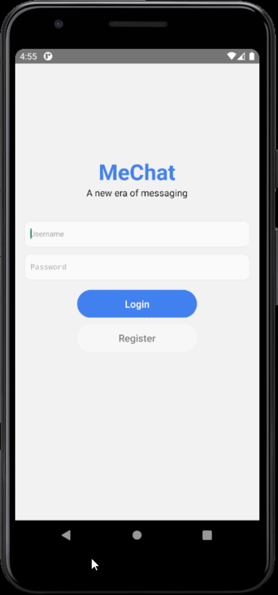
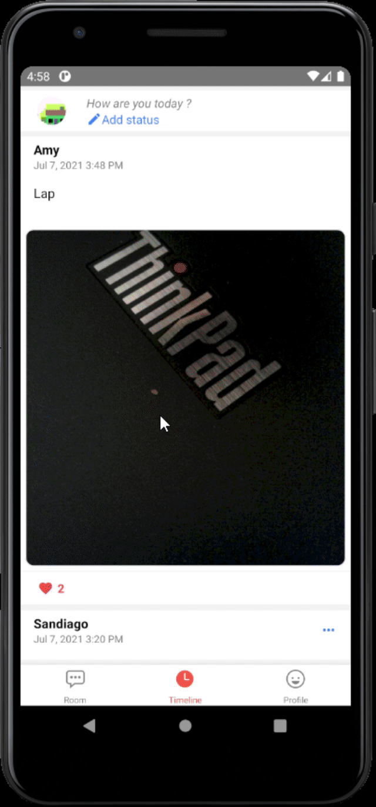
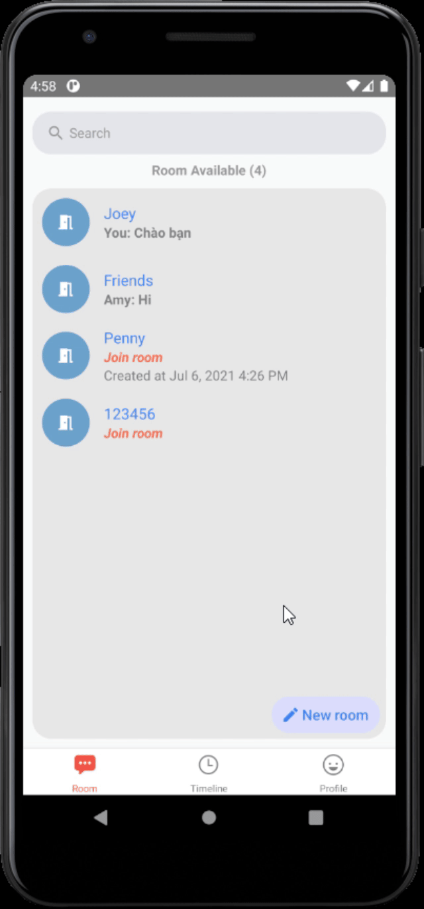
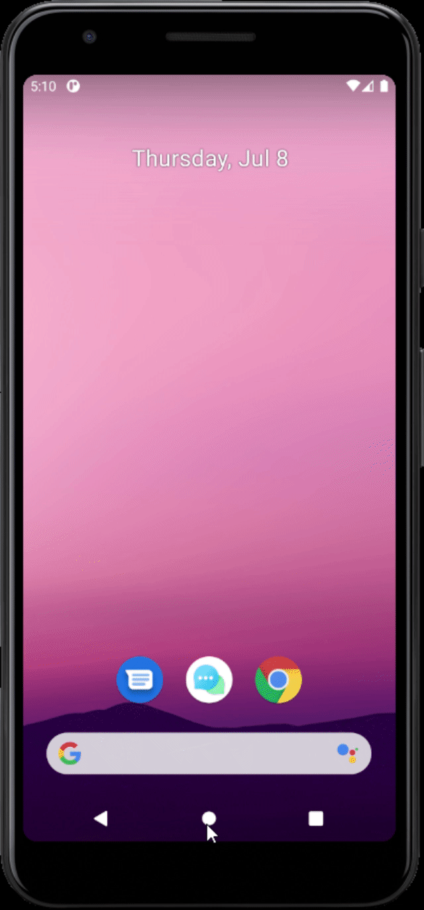
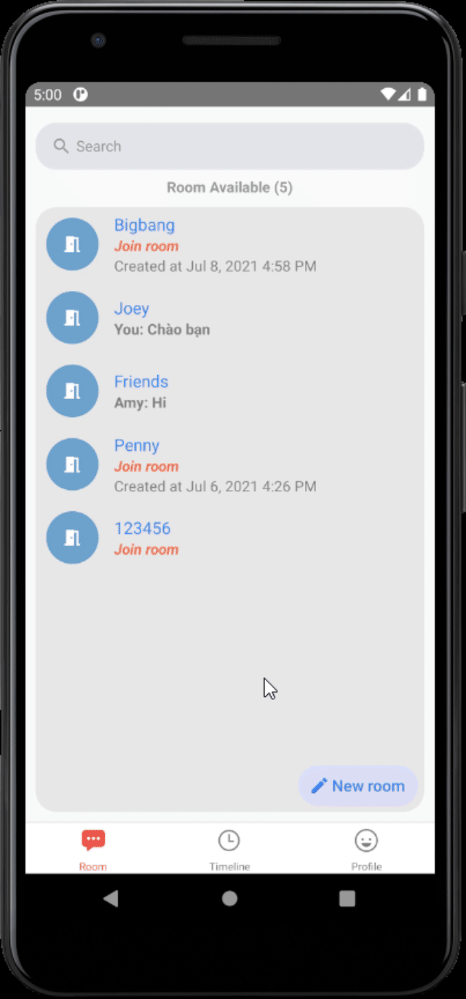

<h1 align="center">

    <br>
    MeChat
</h1>

<h4 align="center">
Contact me at <a href="mailto:binhdlt.work@gmail.com">mail</a> to about more.<br/>I have developed this project in Android Device, and haven't test in IOS yet.
</h4>

<h4 align="center">
MeChat app layout. 
</h4>

<br>
<p align="center">
 <br>
</p>
<br>
<p align="center">
  Under login screens
</p>

<p align="center">
 <br>
   
   
   
   
   

  
</p>

## Install and Run the project

```
npm install
npm run start
```

## Run Push Notification Server

```
cd functions
npm run start
```

## Note while installing

### Rename App Name

```
npx react-native-rename <newName>
```

### Fix Warning Error from package <strong>react-native-gifted-chat</strong>

```
Animated.event now requires a second argument for options
```

- Install patch-package:

```
npm install -g patch-package
```

- In your root of project create a folder name patches and inside patches folder create a file with name: <strong>react-native-lightbox+0.8.1.patch</strong> with the following content:

```diff
diff --git a/node_modules/react-native-lightbox/LightboxOverlay.js b/LightboxOverlay.js
index 9e01f9a..d093b44 100644
--- a/node_modules/react-native-lightbox/LightboxOverlay.js
+++ b/node_modules/react-native-lightbox/LightboxOverlay.js
@@ -99,7 +99,7 @@ export default class LightboxOverlay extends Component {
      onPanResponderMove: Animated.event([
        null,
        { dy: this.state.pan }
-      ]),
+      ], { useNativeDriver: false }),
      onPanResponderTerminationRequest: (evt, gestureState) => true,
      onPanResponderRelease: (evt, gestureState) => {
        if(Math.abs(gestureState.dy) > DRAG_DISMISS_THRESHOLD) {
@@ -115,7 +115,7 @@ export default class LightboxOverlay extends Component {
        } else {
          Animated.spring(
            this.state.pan,
-            { toValue: 0, ...this.props.springConfig }
+            { toValue: 0, useNativeDriver: false, ...this.props.springConfig }
          ).start(() => { this.setState({ isPanning: false }); });
        }
      },
@@ -144,7 +144,7 @@ export default class LightboxOverlay extends Component {

    Animated.spring(
      this.state.openVal,
-      { toValue: 1, ...this.props.springConfig }
+      { toValue: 1, useNativeDriver: false, ...this.props.springConfig }
    ).start(() => {
      this.setState({ isAnimating: false });
      this.props.didOpen();
@@ -161,7 +161,7 @@ export default class LightboxOverlay extends Component {
    });
    Animated.spring(
      this.state.openVal,
-      { toValue: 0, ...this.props.springConfig }
+      { toValue: 0, useNativeDriver: false, ...this.props.springConfig }
    ).start(() => {
      this.setState({
        isAnimating: false,
```

- Run:

```
patch-package
```

### Install package manually

```
npm install @react-navigation/native
npm install react-native-reanimated react-native-gesture-handler react-native-screens react-native-safe-area-context @react-native-community/masked-view
npm install @react-navigation/stack
npm install react-native-elements
npm install react-native-gifted-chat
npm install --save @react-native-firebase/app
```
